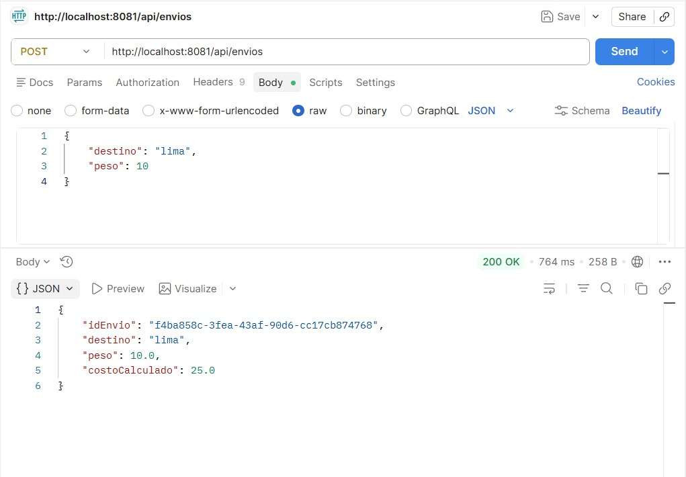
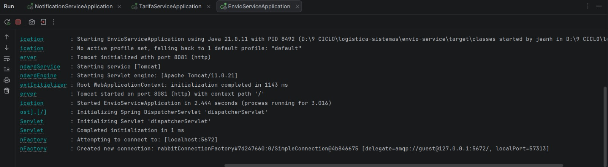
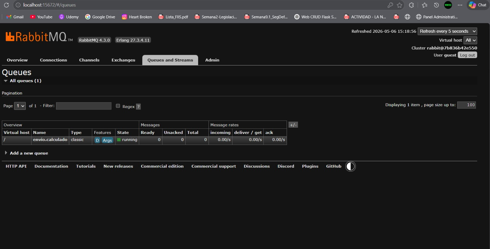
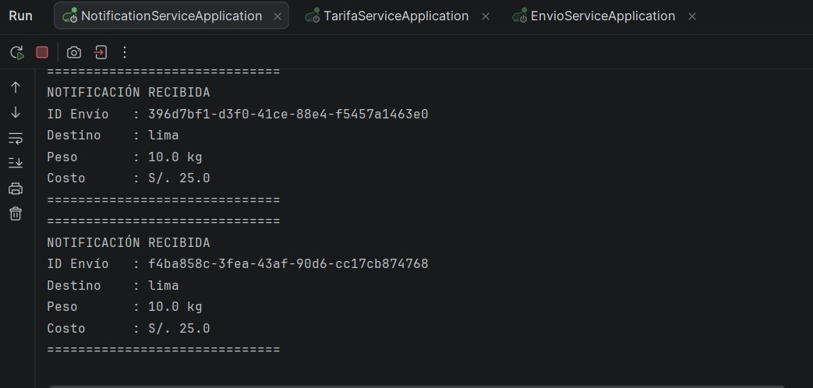

# Logística Sistemas — Arquitectura Híbrida de Microservicios

Proyecto desarrollado como parte del **Examen Práctico de Integración de Sistemas de Software**.  
Implementa una arquitectura híbrida que combina **Orquestación Síncrona** y **Coreografía Asíncrona** usando Spring Boot y RabbitMQ.

---

## ¿Qué hace este proyecto?

Una empresa de logística necesita integrar 3 servicios:

- **envio-service**: recibe la solicitud del cliente, orquesta el cálculo de tarifa y publica el evento.
- **tarifa-service**: calcula el costo del envío de forma síncrona.
- **notification-service**: reacciona automáticamente al evento publicado en RabbitMQ.

---

## Arquitectura

```
Cliente (Postman)
      │
      ▼ POST /api/envios (JSON)
┌─────────────────┐
│  envio-service  │  :8081
│  (Orquestador)  │
└────────┬────────┘
         │ POST síncrono → tarifa-service
         ▼
┌─────────────────┐
│ tarifa-service  │  :8082
└────────┬────────┘
         │ Evento EnvioCalculado (Asíncrono)
         ▼
┌─────────────────┐
│    RabbitMQ     │  :5672
└────────┬────────┘
         │ Consume evento
         ▼
┌──────────────────────┐
│ notification-service │  :8083
└──────────────────────┘
```

---

## Microservicios

| Servicio | Puerto | Responsabilidad |
|---|---|---|
| `envio-service` | 8081 | Orquesta el flujo y publica eventos |
| `tarifa-service` | 8082 | Calcula el costo del envío |
| `notification-service` | 8083 | Escucha eventos y notifica |

---

## 🛠️ Tecnologías

- Java 17
- Spring Boot 4.0.6
- Spring AMQP (RabbitMQ)
- Maven Multi-module
- Docker
- Lombok
- Postman

---

## Despliegue

### 1. Levantar RabbitMQ con Docker

```bash
docker run -d --name rabbitmq -p 5672:5672 -p 15672:15672 rabbitmq:management
```

Panel de administración: [http://localhost:15672](http://localhost:15672)  
Usuario: `guest` | Contraseña: `guest`

### 2. Levantar los microservicios (en este orden)

```bash
# 1ro
cd tarifa-service && ./mvnw spring-boot:run

# 2do
cd notification-service && ./mvnw spring-boot:run

# 3ro
cd envio-service && ./mvnw spring-boot:run
```

---

## Uso de la API

### Crear un envío

**POST** `http://localhost:8081/api/envios`

```json
{
    "destino": "lima",
    "peso": 10
}
```

### Respuesta

```json
{
    "idEnvio": "4c7bfcef-96be-48e8-9167-7afd8617f6b8",
    "destino": "lima",
    "peso": 10.0,
    "costoCalculado": 25.0
}
```

---

## Evidencias

### Petición POST desde Postman


### Evento publicado en RabbitMQ


### Panel de RabbitMQ


### Notificación recibida en notification-service


---

## Estructura del Proyecto

```
logistica-sistemas/
├── pom.xml                          ← Proyecto padre Maven
├── envio-service/
│   └── src/main/java/com/logistica/envio/
│       ├── EnvioController.java
│       ├── EnvioService.java
│       ├── EnvioRequest.java
│       ├── EnvioCalculadoEvent.java
│       ├── TarifaClient.java
│       ├── TarifaRequest.java
│       ├── TarifaResponse.java
│       └── RabbitMQConfig.java
├── tarifa-service/
│   └── src/main/java/com/logistica/tarifa/
│       ├── TarifaController.java
│       ├── TarifaRequest.java
│       └── TarifaResponse.java
└── notification-service/
    └── src/main/java/com/logistica/notificacion/
        ├── NotificacionListener.java
        ├── EnvioCalculadoEvent.java
        └── RabbitMQConfig.java
```

---

## Decisiones de Diseño

- **Orquestación** para `tarifa-service`: el `envio-service` controla directamente la llamada síncrona garantizando que el costo esté calculado antes de continuar.
- **Coreografía** para `notification-service`: reacciona de forma independiente al evento `EnvioCalculado` en RabbitMQ, sin que el orquestador sepa quién lo consume.
- **JSON** como formato estándar de intercambio en todos los servicios.

---

## Estudiante

**Jean Hurtado**  
9no Ciclo — Integración de Sistemas de Software
